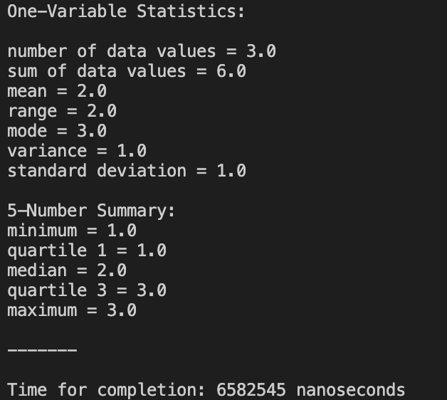

  

This is a repository where I push my code for various statistical calculations. This library contains computations for one-variable statistics, the standard normal distribution, confidence intervals, significance tests, linear regression, binomial & geometric distributions, and more. I am currently working on finalizing documentation for all the current methods in the library, in order to release version 1.0. 

### How does the user input data? ###

It's actually quite simple. For all the classes, I have included <samp>main</samp> methods, which allow the programs to be run. In each method (for most of the classes), I have set up some bracketed sections, where the user can input a number, array, or whatever is needed (shown below). With respect to the classes that do not have this bracket system, I am working on it :) 

  

### How does the user receive outputs? ###

Every <samp>main</samp> method inside each class has statements that print out the output for the respective class. The user does not need to add any print statements, as everything has been pre-written. For example, here is the console output for the <samp>OneVar</samp> class: 
  

  

