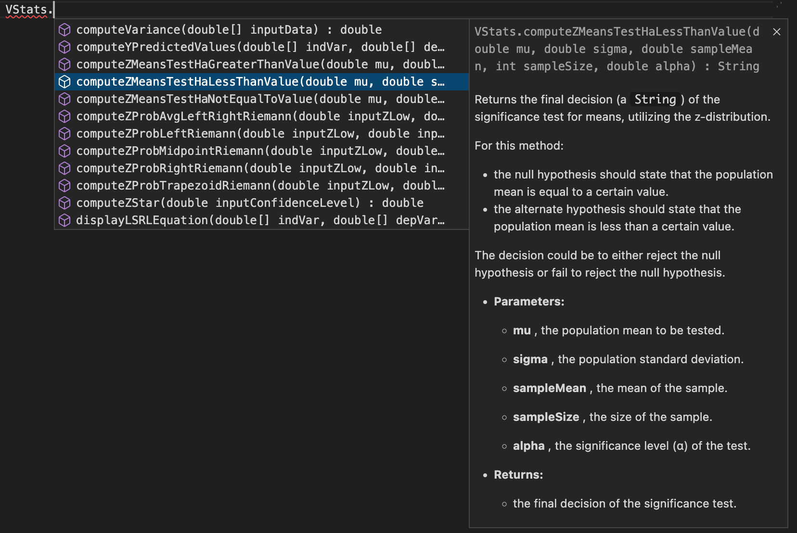

# VStats

  

This is the VStats Java library that computes statistics. The functionalities available include one-variable statistics, binomial & geometric distributions, matrix operations, linear regression computations, confidence intervals, significance tests, etc. 

The VStats library is condensed into a JAR file, which can be located in this project. That way, users can import VStats into their Java projects. 

## Importing into Projects 

Since I use the VS Code IDE, I will provide instructions here on how to import the JAR file into a Java project opened in VS Code. 

1. Download the ZIP of the entire project or clone the repository onto your computer. 
2. Locate the JAR file in the project (VStats/VStats-master/src/build/VStats.jar if you downloaded or VStats/VStats/src/build/VStats.jar if you cloned the repository). 
3. Open a Java project in VS Code and click on a <samp>.java</samp> file. Towards the bottom of the File Explorer window, you should see a dropdown menu called <samp>Java Projects</samp>. 
4. Click on the <samp>Java Projects</samp> menu and locate the <samp>Referenced Libraries</samp> folder. 
5. Click on the "+" icon and add the VStats.jar file from the file path from Step #2. 

## How does the user input data? 

It's actually quite simple. All the methods in VStats are <samp>static</samp>, so they can be called without creating VStats objects. The input data to any method should be the parameter. This works similar to the Java Math library. Also, documentation is provided for all the methods in the library so that users can learn about what each invidual method actually does. The documentation was written using JavaDoc, in order for users to view the method description in a mini window, as shown in the screenshot below. 

  

## Version History

- v1.0 - RELEASE. 

## License 

The VStats library is protected by the <a href="https://github.com/CaptMD-11/VStats/blob/master/LICENSE.txt" target="_blank">GNU GPL</a> license. 